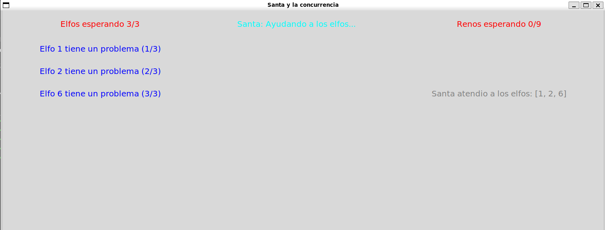
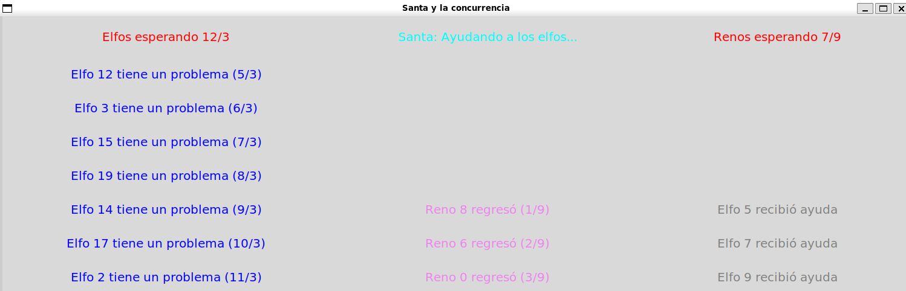
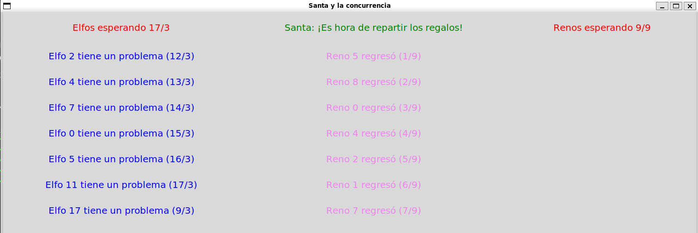

# Tarea 2: El problema de Sincronizacion de Santa Claus
 **Autores** Brena de León Victor Javier, Cruz Manriquez Lizbeth
## 1. Captura de l progrma en ejecucion





## 2. Descripción
Este programa simula el problema de concurrencia "Santa Claus", donde:
- Santa Claus duerme hasta que:
  - Llegan los 9 renos → inicia el reparto de regalos
  - Hay 3 elfos con problemas → los ayuda

- Los elfos:
  - Trabajan constantemente
  - Cuando 3 tienen problemas, despiertan a Santa

- Los renos:
  - Regresan de vacaciones
  - Cuando los 9 llegan, despiertan a Santa

El problema esta en sincronizar las entidades para que Santa solo despierte cuando sea necesario, dando prioridad a los renos sobre los elfos, y asegurando que ningún proceso entre en una condición de carrera.

## 3. Instrucciones de compilación/ejecución
- Es necesario tener instalado python con las biblioteca de ``Tkinter``.
- A su vez en necsesario que el entorno sea Unix/Linux. 
- Seguido desde la terminal:
```
python3 minishell.py
```

## 4. Estrategias de sincronizacion
- **Uso de Mutex:** En el codigo utilizado como ``threading.Lock`` para porotger las variables globales, ``elfos_esperando``,``elfos_esperando``, y algunos contadores. Esto garantizando la exclusion mutua.
- **Uso de semaforos, en el codigo ``threading.Semaphore``**: 
    - Podemos identificar el uso de este en ``santa_sem`` para identificar cuando hay 9 o 3 renos en espera.
    - Tambien se uso arreglos de semaforos individuales para bloquear cada elfo(``elfos_sem``) o reno(``renos_sem``) especifico hasta que santa los libere.
- **Implemntacion de una GUI:**
  - Los hilos de los elfos/renos actúan como productores de mensajes, mientras que la interfaz gráfica actúa como consumidora a través de funciones que revisan periódicamente las listas (``revisar_mensajesE``, ``revisar_mensajesR``). 

## 5. Refinamientos Implementados
El problama no contaba con refinamientos establecidos, pero se hcieron algunos.
1. Interfaz grafica: Esta fue realizada de forma dinamica, separanda la interfaza en 3 columnas(Frames) principales, para visualizar las notificaciones de los elfos, renos y las actividades de santa.

2. Notificaciones temporales: Como se mencionon se uso Labels temporales, los cuales son mensajes que aparecen y se destruyen automaticamente, haciando uso del metodo ``after()`` de la biblioteca ``Tkinter``, esto con el objetivo de no saturar la interfaz.

3. Se implemento un cierre general: Con ayuda de ``threading.Event`` llamando ``stop_event``, esto se vinculo al cierre de la venta de la interfaz. Asegurando una finalizacion correcta del programa.

## 6. Áreas de Mejora y Observaciones
- **El uso de la interfaz:** Al utilizar la interfaz, y que se pueideran observar los cambios se añadieron contadores, pero los contadores en el caso de los elfos, sobrepasa el limite de 3, y genera una fila de espera, aparenta entrear a un deadlock, pero no, solo es por la naturaleza de la GUI ya que se le agrego en varias partes del codigo ``time.sleep`` para observa las notifiaciones y mensajes de Santa.

- Mejor manera de uso de las notifiaciones: como se menciona los procesos se realizan tan rapido que estaria mejor encontrar una menera eficiente de mostrar cada una de las notificaciones.