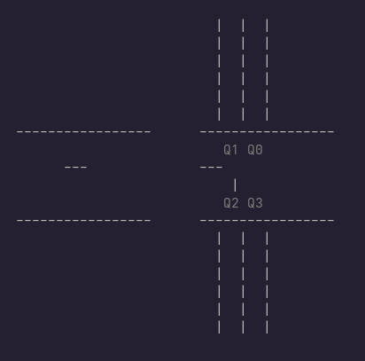
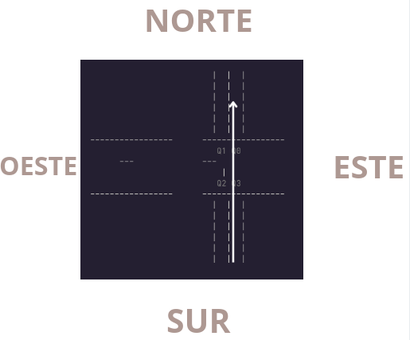
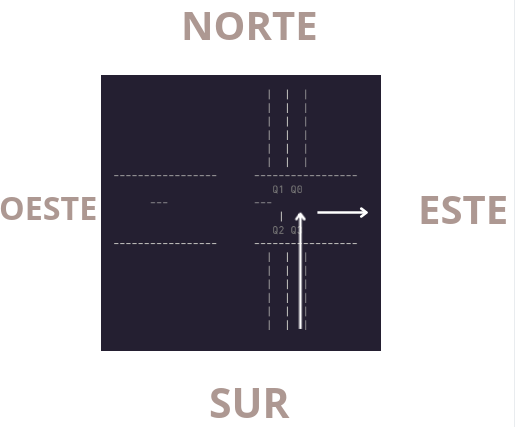
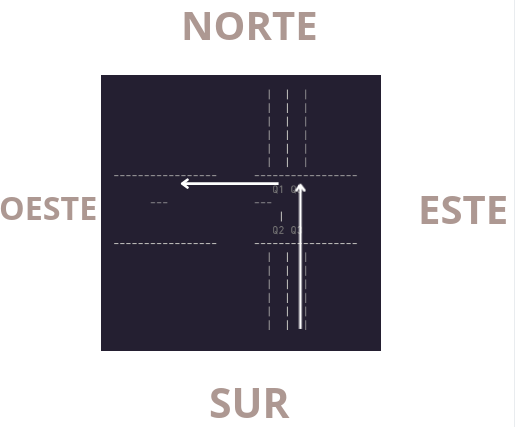
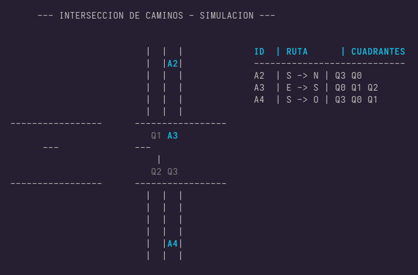
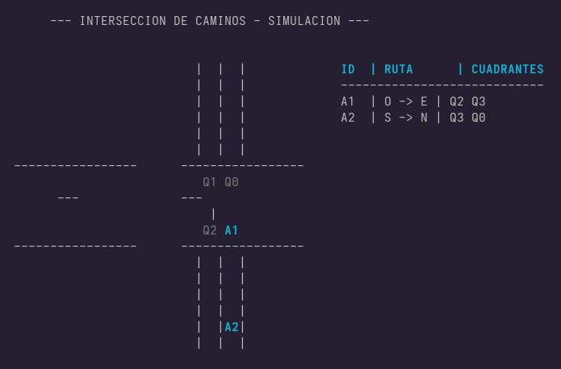

# Tarea 2: Simulación de Intersección de Caminos en C++

## Autores
 - Navarro Carbajal Fredy Emiliano 
 - Ramírez Terán Emily 

## Descripción del Proyecto
En esta tarea de decidió por el problema 2 de las diapositivas `SIMULACIÓN DE INTERSECCIONES`, donde nuestro objetivo fue hacer una buena gestión de recursos (cuadrantes) compartidos y la sincronización correcta de los hilos (autos).
El problema menciona una intersección en forma de cruz donde circulan autos, y nos piden hacer una simulación de los autos en el cruce.
Formas de resolverlo:

 1. Podemos considerar la intersección cono un solo recurso, esto implica que un solo auto pueda pasar a la vez, esto es una opción pero no la mejor porque evita que mas coches puedan pasar sin necesidad de interferir en el camino del otro.
 2. La segunda opción es dividir la intersección en 4 cuadrantes, y solo bloquear aquellos cuadrantes que el auto quiera utilizar dependiendo su ruta, es es mejor porque permite que mas coches puedan pasar, mejorando la eficiencia.
 A partir de estas 2 opciones nos quedamos con la segunda. Para esta opción mostraremos de forma grafica los que queremos realizar:
  
 
 
 De esta forma es como se ve nuestra intersección, cada una tiene un punto de inicio que son nuestros puntos cardinales, y lo que nos dice el problema es que van a existir autos pasando. Como sabemos esos autos tienen un punto de inicio pero también tienen un punto de salida, para la salida solo tienen permitido las siguientes situaciones:
 


Como podemos ver el coche inicia en el sur y finaliza en el norte, aquí lo podemos ver como el auto ocupa 2 recursos que serian los dos cuadrantes.



En esta situación el coche inicia en sur y quiere ir al este para esta situación nuestro coche solo utiliza un solo recurso.



Finalmente la ultima ruta que un coche puede tomar es vuelta a la izquierda para este caso es el que cuesta mas ya que toma mayor cantidad de recursos (3 cuadrantes).

Como vimos estos son los tres casos de rutas, pero solamente cuando el coche inicia en el sur, para los demás puntos de entradas existe de igual forma tres rutas, es decir que en general existen 12 formas de pasar la intersección.
Estas imágenes si la vemos con mas autos pasando  podemos observar que hay ciertos casos donde mas de un auto pueden pasa a la vez lo cual ayuda a mejorar nuestra simulación.


## Entorno de Ejecución
* Lenguaje de programación: C++ (versión C++17)
* Sistema Operativo: Distribución Fedora basada en Linux/Unix.
* Compilador: GCC (`g++`) con soporte para C++ estándar.
* Bibliotecas para concurrencia: `<thread>` y `<mutex>`.
* Biblioteca para entorno visual: `ncurses`.

## Instrucciones de Uso
Primero verificar si tenemos instalado ncurses:

 - Debian

```bash
sudo apt update && sudo apt install libncurses-dev
```

 - Fedora

```bash
sudo dnf install ncurses-devel
```
Para compilar el código desde la terminal, utiliza el siguiente comando:
```bash
g++ -std=c++17 interseccion_de_caminos.cpp -o interseccion_de_caminos -lpthread -lncurses
```
Una vez compilado, puedes iniciar el intérprete ejecutando:
```bash
./interseccion_de_caminos
```
## Estrategia de sincronización  
La estrategia para esta simulación se baso en el uso de `MUTEX`, a continuación se explicara el porque el uso de esta estrategia:

 - A diferencia de otro tipo de estrategias el uso de mutex posee el una propiedad que le permite adueñarse de los recursos, ya que solo el hilo que bloquea el recurso es capaz de liberarlo, lo que garantiza la integridad a la hora del cruce en la intersección.
 - Dado que en la intersección los manejamos como 4 cuadrantes (recursos), el mutex por naturaleza maneja los recursos adecuadamente es decir es dueño o no de un cuadrante o más, lo que evita sobrecarga que implicaría gestionar contadores en semáforos.
 
**Como gestionamos los recursos para evitar  `Deadlock`:**
 
 - Los Deadlock en esta simulación ocurren cuando mas de un coche quieren usar mas de un recurso o cuadrante, y si un auto o hilo quiere moverse a otro recurso, en una posición donde ya hay un auto y este auto también quiere ir donde ya esta el auto, no existe una regla que ayude a controlar esto lo que provocara que ambos fallen, para esto usamos esta función:
	 - `lock(m1, m2, mn)` esto nos ayuda para que cada auto adquiera todos los mutex o recursos y no provoque estancamiento.
 - Por otro lado para asegurar el bloqueo de los recursos no apoyamos de `lock_guard` esto nos asegura que los recursos se liberan automáticamente y no existan mutex huérfanos. 

 **REFINAMIENTOS**
 
**Refinamiento 1**
Para este primer refinamiento lo que se nos pide es evitar la inanición, esto se enfoca en el orden y justicia, esto sucede porque existen hilos mas lentos que otros debido a que usan menos recursos y a la hora de liberarlos es más rápido, esto provoca que no haya igualdad y los autos que sean mas rápidos (usen menos recursos) les ganen.
Para esto en mutex que se utilizo funciona como una estructura FIFO (first in, first out), de esta forma cada hilo debe tomar su turno antes de bloquear sus recursos. Así los hilos puedan respetar sus ordenes de llegada sin importar que unos sean más rápidos que otros.

 **Refinamiento 2**
Para este refinamiento se enfoca en la eficiencia. Cuando nos referimos a la falta de eficiencia es cuando pensamos en el programa de la siguiente forma, cuando la intersección la tratamos como un recurso global, es decir que solo un auto puede pasar a la vez en la intersección lo que provocaría un estancamiento arruinando el programa, para esto se pensó en la siguiente solución: 
La intersección la dividimos en 4 partes o cuadrantes lo cual representaran nuestros recursos que podemos usar, esta segmentación nos permite que mas de un coche pueda pasar al mismo tiempo, ya que no es necesario bloquear todo el cruce ya que solo existen tres posibilidades de rutas:

 - Seguir derecho solamente nos ocupa dos cuadrantes
 - Girar a la derecha solo ocupa un cuadrantes
 - Girar a la izquierda ocupa 3 cuadrantes
  
 De esta forma evitamos bloquear toda la intersección y solo bloqueamos ciertos cuadrantes, así mejoramos el rendimiento para que mas de un coche pueda pasar.
 
## Diseño del programa 

 **Arquitectura de los Hilos** 
 - **Hilo Padre**
 Este hilo fue el encargado de administrador de los recursos.
 En el `main` es el único encargado de crear el objeto `ControlPaso`, asegurando que exista una única instancia de los mutexes de los cuadrantes para que todos los hilos compitan por los mismos recursos reales.
Se utilizo un ciclo controlado con `this_thread::sleep_for` para instanciar los hilos de los autos de forma secuencial. Esto para evitar condiciones de carrera antes de que la interfaz `ncurses` esté lista.
Al terminar el ciclo de creación de los autos, el padre entra en un estado de espera activa mediante `.join()`. Esto garantiza que el proceso principal no muera y libere la memoria hasta que el último auto haya completado su ciclo de vida y salido de la intersección.

 - **Hilo Visualización**
Este hilo inicia mediante el método `.detach()` para que su ciclo de vida sea independiente del flujo de creación de los autos.
Este hilo se encarga de hacer un monitoreo cada 100 ms sobre `posiciones_vivas`, esto para realizar la traducción de los mutexes a una forma grafica, este hilo no tiene ninguna toma de decisiones en los autos, solo sirve como un observador para nuestra representación gráfica.
Aunque solo es un observador, este tiene que adquirir los mutex antes de realizar un cambio la interfaz, esto asegura la consistencia de datos, esto evita que la terminal intente dibujar un auto en una coordenada que está siendo modificada en ese preciso instante por un hilo auto.
 - **Hilo Autos**
Aquí se crean los autos donde cada uno encapsula su propia lógica para su navegación en el cruce, para esto se crea un ciclo de vida que garantice las reglas que establecimos.
Primero hacemos la creación de los hilos para esto usamos la función random para poder generar características aleatorias para los coches, dando un origen y un destino.
Ahora inicia la parte de sincronización donde cada uno de los hilos adquieren los dos refinamientos mencionados (FIFO y bloqueo de cuadrantes), en este punto los hilos pueden quedar en espera dependiendo de los recursos libres. 
Una vez que exista control de los recursos para un hilo, este ya se puede mover sobre la ruta de sus cuadrantes.
Una vez fuera de la intersección los hilos pueden liberar sus recursos, dando lugar a que otro hilo pueda seguir su ciclo.

## Ejemplos de ejecución 



## Aciertos y Retos 
En cuanto los aciertos que obtuvimos fue poder diseñar el ciclo de hilo auto y como este se debía de comportar de acuerdo a los refinamientos que se nos propusieron, así como identificar que mecanismo era el apropiado para nuestro caso (**MUTEX**).
Implementaciones como el mapa de rutas, nos facilito identificar como los autos se debían de mover, en cuanto al cerebro de la operación de fue **ControlPaso** supimos manejar de manera correcta el bloqueo de nuestros recursos cuando fueran necesarios de esta forma evitamos Deadlock. 
Creando una estructura **EstadoAuto** pudimos manejar de forma mas estructurada los componentes de nuestros hilos en la parte visual.

Por otro lado los retos fueron complicados principalmente en la parte visual ya que muy pocas veces habíamos manejado entornos visuales. El simple hecho de decidir la ubicaciones de los componentes nos costo demasiado, en este caso fue donde pedimos ayuda a un **LLMs**, en primer lugar por la falta de experiencia en el manejo de entornos visuales, ya que no sabíamos como conectar la parte central de los hilos y el mutex, con la parte visual. Ademas de esto, sobrescribir los datos de nuestra tabla de estados nos estaba costando arreglar, ya que no podíamos mantener los datos de manera estable y su liberación. Otro problema que surgió al establecer los tiempos de espera ya que sin estos la parte visual no podía seguir de forma correcta el ciclo de los autos.   

Para finalizar aunque tuvimos buenos aciertos y errores, pudimos concluir de manera satisfactoria esta tarea. Quedando con un mejor entendimientos de patrones de concurrencia en nuestro caso con el uso de **MUTEX** y de esta forma aunque fue con un problema relativamente pequeño pudimos tener una mejor idea de como nuestro **SO** puede funcionar en ciertas tareas. 

