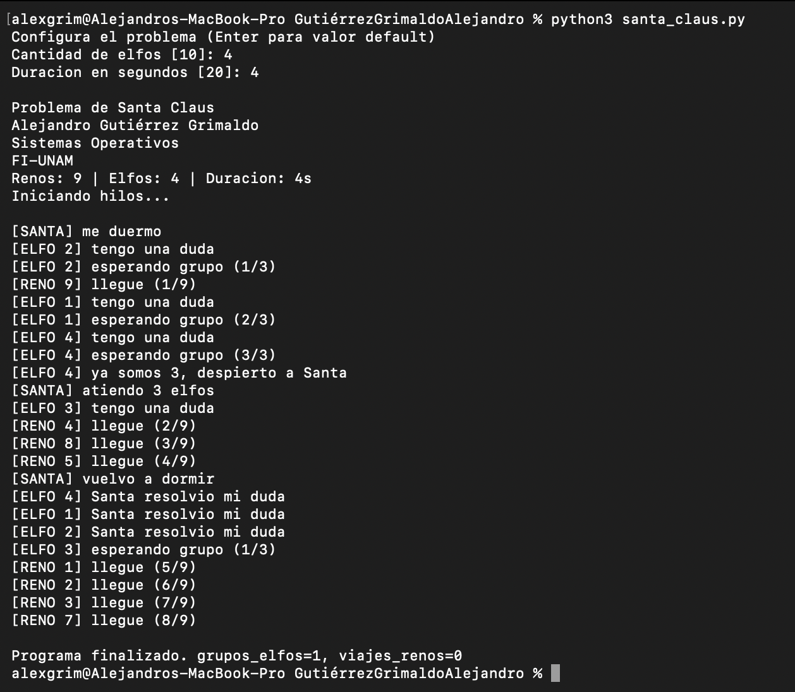

# Problema de Santa Claus

## Descripcion

Este proyecto implementa una version del problema de Santa Claus usando hilos y semaforos en Python.

La idea general es la siguiente:

- Santa duerme mientras no haya trabajo pendiente.
- Los renos regresan de vacaciones y cuando llegan los 9, despiertan a Santa.
- Los elfos trabajan y cuando hay 3 con dudas, despiertan a Santa para pedir ayuda.
- Si al mismo tiempo hay renos y elfos, se atiende primero a los renos.

---

## Requisitos

- Python 3

Este programa se ha desarrollado y probado en un entorno Unix/Linux, pero debería funcionar en cualquier sistema con Python 3 instalado.

---

## Ejecucion del programa

Para ejecutar el programa:

    python3 santa_claus.py

Al iniciar, el programa pide:

- Cantidad de elfos
- Duracion de la simulacion (segundos)

Si solo se presiona Enter, se usan valores por defecto.

### Sobre el tiempo de simulacion

El tiempo no es obligatorio para modelar el problema, pero en esta implementacion se usa para cerrar la simulacion de forma automatica y limpia.

Si no hubiera tiempo limite, el programa se quedaria ejecutandose indefinidamente hasta interrumpirlo manualmente.

Cuando termina el tiempo:

- Se marca el fin de la simulacion.
- Se liberan semaforos para evitar hilos bloqueados.
- Se imprime un resumen final.

---

## Funcionamiento

El programa funciona de la siguiente manera:

1. Se crean hilos para Santa, renos y elfos.
2. Santa queda bloqueado en un semaforo hasta que alguien lo despierte.
3. Cada reno regresa despues de un tiempo aleatorio y aumenta un contador compartido.
4. Cuando el contador de renos llega a 9, se despierta a Santa.
5. Cada elfo puede unirse al grupo de espera solo si hay menos de 3.
6. Cuando hay 3 elfos esperando, se despierta a Santa.
7. Santa revisa primero renos y luego elfos, siguiendo la prioridad pedida.

---

## Mecanismo de sincronizacion

Se usan semaforos para:

- Dormir y despertar a Santa.
- Liberar a los renos cuando Santa termina de prepararlos.
- Liberar al grupo de 3 elfos cuando Santa termina de ayudarlos.
- Proteger contadores compartidos (renos y elfos esperando).

Tambien se usa un semaforo para imprimir sin mezclar mensajes de varios hilos.

---

## Captura de ejecucion

---

## Dificultades encontradas

Durante el desarrollo, los puntos mas importantes fueron:

- Evitar condiciones de carrera en los contadores compartidos.
- Respetar que los elfos solo pasen en grupos de 3.
- Mantener la prioridad de renos sobre elfos cuando coinciden eventos.
- Terminar la simulacion sin dejar hilos bloqueados en semaforos.

---

###### Alejandro Gutierrez Grimaldo  

