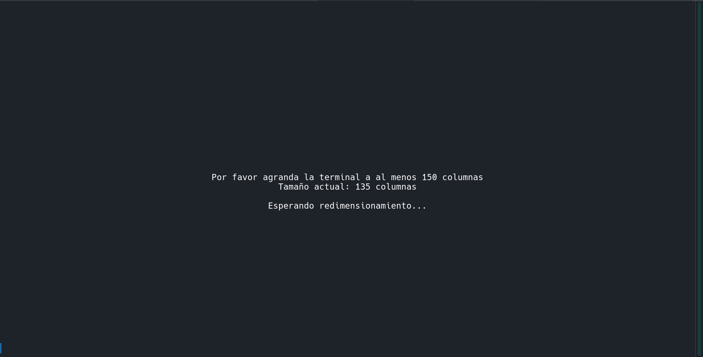
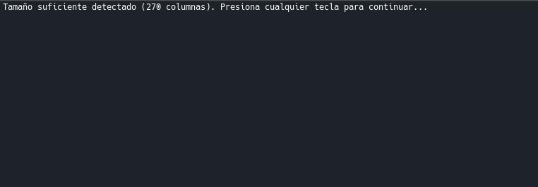

---
links_url:
  - "[indicaciones](https://github.com/unamfi/sistop-2026-2/tree/main/tareas/2)"
---
# 1. Problema de **Santa Claus**
Se ha implementado una solución al **Problema de Santa Claus**. En este ejercicio se modela un sistema donde un hilo central (Santa) debe coordinar la atención a dos grupos de procesos con requisitos y prioridades distintas:

- **Los Elfos:** Requieren ayuda cuando se acumulan exactamente **3** con problemas. Santa los ayuda simultáneamente.
- **Los Renos:** Regresan de vacaciones uno a uno. Solo cuando los **9** están presentes, Santa debe despertar para entregar los regalos de Navidad.
- **Prioridad:** El sistema garantiza que los renos tengan prioridad absoluta; si los 9 renos están listos, Santa los atenderá antes que a cualquier grupo de elfos.

# 2. Lenguaje y entorno de desarrollo

- **Lenguaje:** Python 3
- **Bibliotecas:** `threading` (hilos y semáforos), `time`, `random` y `curses` (interfaz de terminal).
- **Entorno recomendado:** Sistemas basados en Unix/Linux (como Arch Linux).

## **Requisitos para la ejecución:**
1. **Archivos ASCII:** El programa requiere que existan dos archivos de texto en el mismo directorio: `zzz.txt` (Santa durmiendo) y `up.txt` (Santa despierto).
2. **Dependencias (Windows):** Si se ejecuta en Windows, es obligatorio instalar la librería de compatibilidad de curses mediante:
```PowerShell
pip install windows-curses
```

- **Tamaño de Terminal:** Debido a la interfaz visual, se requiere una terminal con un ancho mínimo de **270 columnas**. El programa incluye un validador que pausará la ejecución hasta que la terminal tenga el tamaño adecuado.

## **Comando de ejecución:**
```Bash
python tarea2.py
```
# 3. Estrategia de sincronización

Se empleó una combinación de mecanismos para asegurar que el sistema esté libre de condiciones de carrera y bloqueos mutuos (_deadlocks_):

- **Exclusión Mutua (Mutex):**
    - `mutexElfo` y `mutexReno`: Protegen los contadores `cuentaBarreraElfos` y `cuentaBarreraRenos`. Sin estos, varios hilos podrían intentar modificar el contador al mismo tiempo, causando errores en la lógica de las barreras.
- **Señalización (Semáforo `santaSemaforo`):**
    - Actúa como un timbre. Santa se bloquea en un `.acquire()`. Cuando un grupo de elfos (3) o renos (9) se completa, envían un `.release()` para despertar al hilo de Santa.
- **Barreras de Sincronización:**
    - `barreraElfos` y `barreraRenos`: Son semáforos donde los hilos de los trabajadores se "estacionan". Santa libera los permisos en bloque (3 para elfos, 9 para renos) solo cuando está listo para atenderlos.
- **Patrón de Priorización:**
    - Dentro del bucle principal de Santa, se evalúa primero el estado de los renos mediante `if cuentaBarreraRenos == 9`. Esto asegura que la Navidad nunca sea postergada por problemas técnicos de los elfos.

>La solución al problema funciona con n cantidad de elfos (n hilos) pero se decidió ocupar 5 elfos(5 hilos) para poder mostrar el estado actualizado en cada momento de cada uno de los elfos.
# 4. Interfaz y Refinamientos
>**Refinamientos:** *No había refinamientos propuestos*

- **Interfaz Visual (Curses):** Se implementó un panel de control visual que divide la terminal en tres secciones (Santa, Elfos y Renos)


Los elfos, identificados por su ASCII art:
```txt
  ^ ^
 (o.o) 
 o(_ )o
```
Y los renos:
```txt
 ⢀⠴⠀⠀⠀
 ⠸⢄⡠⢦⠀
 ⠀⠈⣿⠃
 ⢳⡿⠿⢿⢤
 ⠜⠀⠀⠀⠈
```

>El diseño de Santa está ligeramente inspirado en la imagen de nuestro querido profesor Gunnar Wolf. Con todo el cariño y respeto, decidimos basarnos en su imagen para retratar en forma de ASCII art a nuestro Santa (Gunnar) Claus [abusando de el comentario que él mismo hizo en una clase](https://www.youtube.com/watch?v=Tpg9pNFxCxg&t=1560s)

Cambio dinámico de **ASCII Art** para reflejar si Santa está en estado de espera (dormido) o en ejecución (despierto).

Cada sección, con su ventana pequeña que despliega mensajes importantes, como que:
- `<<<DESPERTÉ Y VOY A AYUDAR>>>`
- `<<<VOLVERÉ A DORMIR>>>`

Informa del estado de **elfos** (quien está trabajando y quién ha encontrado un problema)
- Añadiendo un ASCII elfo cada que aparece uno

Informa qué reno está de vuelta, o sigue de vacaciones
- Añadiendo un ASCII reno cada que vuelve uno de vacaciones


---
# Guía de Ejecución y Configuración

## **A. Para Usuarios Linux (Nativo)**

El programa está diseñado para funcionar de forma nativa en sistemas Unix/Linux.
1. **Asegurar dependencias:** La mayoría de las distribuciones de Linux ya incluyen `python3` y la librería `ncurses`.
2. **Preparar archivos:** Verifica que en la carpeta del script existan los archivos `zzz.txt` y `up.txt`.
3. **Ejecutar:** Abre una terminal y lanza el programa:
```bash
python3 tarea2.py
```

4. **Ajuste de pantalla:** Si aparece el mensaje de "Tamaño insuficiente", agranda la ventana de la terminal o reduce el zoom con `Ctrl + -` hasta que el validador detecte las columnas necesarias.

---

## **B. Para Usuarios de Windows**

Debido a que la librería `curses` no viene incluida por defecto en la instalación estándar de Python para Windows, se requiere un paso adicional:
1. **Instalar soporte de Curses:** Abre una terminal (PowerShell o CMD) y ejecuta el siguiente comando para instalar el port oficial de la librería:
```PowerShell
pip install windows-curses
```

_Nota: Si el comando `pip` no es reconocido, intenta con `python -m pip install windows-curses`._

- **Preparar archivos:** Asegúrate de que los archivos de arte ASCII (`zzz.txt` y `up.txt`) estén en la misma carpeta que `tarea2.py`.
- **Ejecutar:**

```PowerShell
python tarea2.py
```

2. **Consideraciones de Pantalla:** Windows a veces limita el ancho de la ventana de la terminal. Si el programa pide más espacio del que permite tu monitor:
    - Haz clic derecho en la barra de título de la terminal -> **Propiedades** -> **Diseño**.
    - Aumenta el "Tamaño del búfer de pantalla" (Ancho) a **300**.
    - Reduce el tamaño de la fuente en la pestaña "Fuente" para que el contenido quepa visualmente.

---
# **Funcionamiento General**
Al ejecutar con [**Comando de ejecución:**](#**Comando%20de%20ejecución%20**)
Lo primero que se solicita al usuario es:
- **Redimensionar:** Si cambias el tamaño de la ventana mientras el programa está en la pantalla de espera, presiona cualquier tecla para que el validador actualice la lectura.


- Cuando ya está del tamaño correcto:


- **Ejecución**: Observa la magia de la navidad
>Ejemplo de Santa AYUDANDO A ELFOS (hay 3 elfos)


>Ejemplo de Santa Durmiendo (no hay 9 renos ni 3 elfos)


>Ejemplo de Santa repartiendo los regalos (Note como todos los renos para este punto ya desaparecieron porque salieron a repartir regalos)


- **Salir:** Para detener la simulación de forma segura, presiona `Ctrl + C` en la terminal.