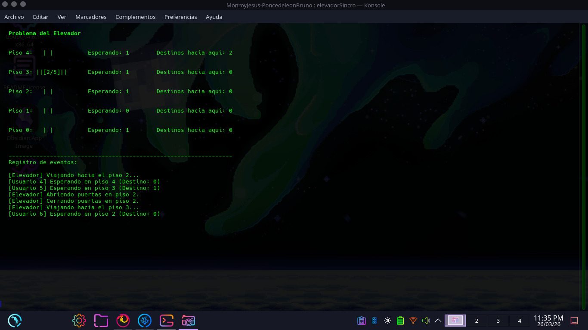
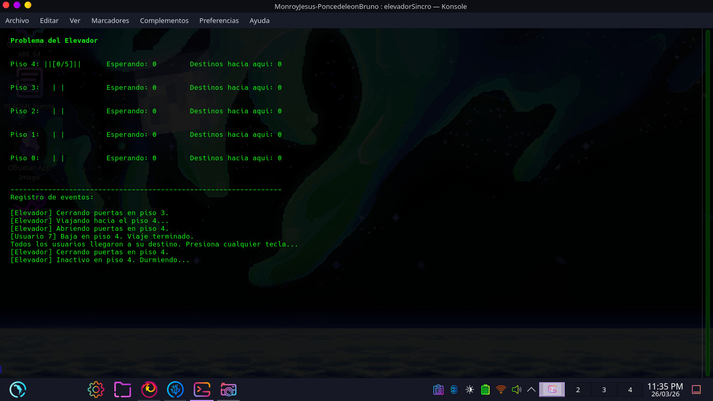

# Tarea 1: Implementación de un intérprete de comandos mínimo (minishell)

Tarea planteada: 2026.03.19
Entrega: 2026.03.26
**Alumnos**: Monroy Tapia Jesús Alejandro
Ponce de León Reyes Bruno

## **Objetivo**

El objetivo primordial de esta actividad es **internalizar y aplicar los mecanismos de exclusión mutua y sincronización** para resolver conflictos de competencia y cooperación entre procesos o hilos. Resolviendo alguno de los problemas propuestos por el profesor en el enlace [Administración de procesos: Ejercicios de sincronización](https://gwolf.sistop.org/laminas/06b-ejercicios-sincronizacion.pdf)

---

## Instrucciones de ejecución y uso basico

Para compilar este programa, es estrictamente necesario enlazar las bibliotecas de hilos POSIX (`pthread`) y de la interfaz de terminal (`ncurses`). Desde la terminal, en el directorio donde se encuentra el archivo `main.c`, ejecuta el siguiente comando:

```bash
gcc elevadorSincro.c -o elevadorSincro -lpthread -lncurses 
```
Una vez compilado, simplemente ejecuta el binario generado:

```bash
./elevadorSincro
```
El programa no requiere argumentos adicionales. Al iniciar, la simulación (TUI) tomará el control de la terminal, generando automáticamente 8 "ingenieros" (hilos) con rutas predefinidas para demostrar el funcionamiento concurrente.

Al finalizar todos los viajes, el programa pedirá presionar cualquier tecla para cerrar la interfaz de forma limpia y devolver el control de la terminal.

---

## Explicación del diseño

La arquitectura de este programa no se basa en un único enfoque, sino en una arquitectura concurrente híbrida que combina tres patrones de diseño clásicos en Sistemas Operativos para resolver diferentes facetas del problema: el estado global, el flujo de trabajo y la interacción física simulada.

### 1. Patrón Monitor

Dado que C no posee soporte nativo para monitores orientados a objetos, este patrón se emuló estrictamente utilizando los mecanismos de `pthreads`.

* **Estado encapsulado:** Las variables globales (`piso_actual`, `pasajeros_abordo`, `espera`, `destinos`) y la interfaz gráfica (`draw_tui()`) conforman el recurso compartido.
* **Exclusión Mutua:** Se utiliza un único candado (`pthread_mutex_t mutex`) para garantizar que ningún hilo lea o modifique el estado del edificio (o la pantalla) simultáneamente, eliminando las condiciones de carrera y la corrupción de la terminal.
* **Suspensión Guardada (Guarded Suspension):** Se utilizan variables de condición (`pthread_cond_t`) dentro de ciclos `while`. Si un hilo no cumple su condición (ej. un pasajero ve que el elevador no está en su piso), libera el mutex y se suspende (`pthread_cond_wait`), evitando el desperdicio de CPU por espera activa (*busy waiting*).

### 2. Patrón Productor-Consumidor

Este patrón rige la lógica global de demanda y atención del sistema.

* **Productores (Hilos de Pasajeros):** Cada ingeniero que llega a un piso "produce" una solicitud al incrementar los contadores de los arreglos `espera` y `destinos`. Al hacerlo, envían una señal para despertar al sistema si estaba inactivo (`pthread_cond_signal(&cond_elevador_wake)`).
* **Consumidor (Hilo del Elevador):** El elevador actúa como el procesador de fondo. Verifica continuamente la existencia de trabajo mediante la función `solicitudes()` y "consume" estas peticiones desplazándose mediante el algoritmo de barrido SCAN, el cual evita la inanición (*starvation*) forzando al elevador a mantener su dirección hasta limpiar todas las peticiones en esa ruta.

### 3. Patrón Rendezvous

Mientras el flujo global es Productor-Consumidor, el instante exacto del abordaje y descenso requiere una sincronización bilateral estricta, implementada mediante un *Rendezvous*.

* **La coreografía:** El elevador y el pasajero entrelazan sus líneas de tiempo. Cuando el elevador llega a un piso con solicitudes, abre las puertas, avisa a los pasajeros (`pthread_cond_broadcast`) y **se bloquea intencionalmente** (`pthread_cond_wait(&cond_elevador, &mutex)`).
* **Confirmación:** El elevador no continuará su ejecución hasta que el hilo del pasajero haya despertado, abordado (modificando `pasajeros_abordo`), y enviado una señal de confirmación de vuelta (`pthread_cond_signal(&cond_elevador)`). Esto garantiza la consistencia física de la simulación: el elevador nunca se va dejando a alguien a medias en la puerta.

### Partes clave del código

* `pthread_mutex_lock(&mutex)` y `pthread_mutex_unlock(&mutex)`: Delimitan absolutamente todas las secciones críticas del código, incluyendo las llamadas a *ncurses*.
* `pthread_cond_wait(&cond_pisos[start], &mutex)`: Pieza central donde los hilos de los usuarios ceden el procesador y el candado de forma atómica hasta que el elevador los notifica.
* `pthread_cond_broadcast(&cond_pisos[piso_actual])`: Utilizado por el elevador para despertar a *múltiples* usuarios simultáneamente en un mismo piso, delegando en ellos la verificación de capacidad máxima (`CAPACIDAD`).

---

## Ejemplo de ejecución

Al ejecutar el programa, la terminal se limpia y muestra dos secciones principales:

1. **Representación Gráfica (Arriba):**



2. **Registro de Eventos (Abajo):**

![[imgT21.jpeg]]

---

## Dificultades encontradas

- **Sincronización de la TUI (ncurses):** Las funciones de _ncurses_ no son _thread-safe_. Hubo problemas iniciales de corrupción de pantalla cuando múltiples hilos intentaban imprimir simultáneamente. Se solucionó protegiendo la función `draw_tui()` con el mismo mutex lógico del elevador.
- **Paso de parámetros a hilos:** La función `pthread_create` solo acepta un puntero `void*`. Fue necesario crear un `struct PasajerosArgs` y usar memoria dinámica (`malloc`) para empaquetar el ID, origen y destino de cada usuario sin generar condiciones de carrera en el ciclo principal.
- **Coreografía de abordaje (Rendezvous):** Lograr que el elevador esperara exactamente a que los usuarios terminaran de subir/bajar sin cerrar las puertas antes de tiempo requirió un ajuste fino en el uso de `pthread_cond_wait` y `pthread_cond_signal`.

### Referencias utilizadas

[1]“NCURSES Programming HOWTO,” _Tldp.org_, 2026. Available: https://tldp.org/HOWTO/NCURSES-Programming-HOWTO/index.html. [Accessed: Mar. 24, 2026]

[2]“pthread_cond_timedwait(3p) - Linux manual page,” _Man7.org_, 2017. Available: https://man7.org/linux/man-pages/man3/pthread_cond_wait.3p.html?utm_source=chatgpt.com. [Accessed: Mar. 24, 2026]

[3]G. Wolf, “Administración de procesos: Ejercicios de sincronización.” Available: https://gwolf.sistop.org/laminas/06b-ejercicios-sincronizacion.pdf. [Accessed: Mar. 27, 2026]

‌

‌‌
