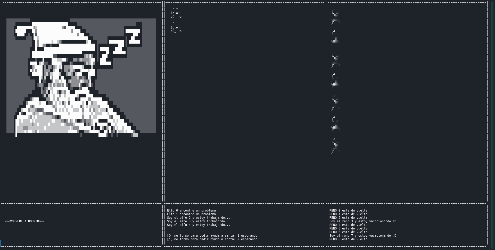
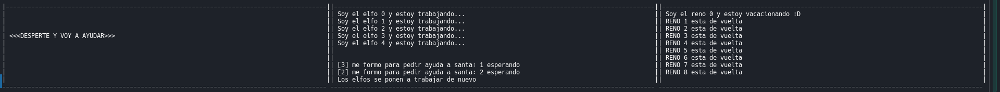
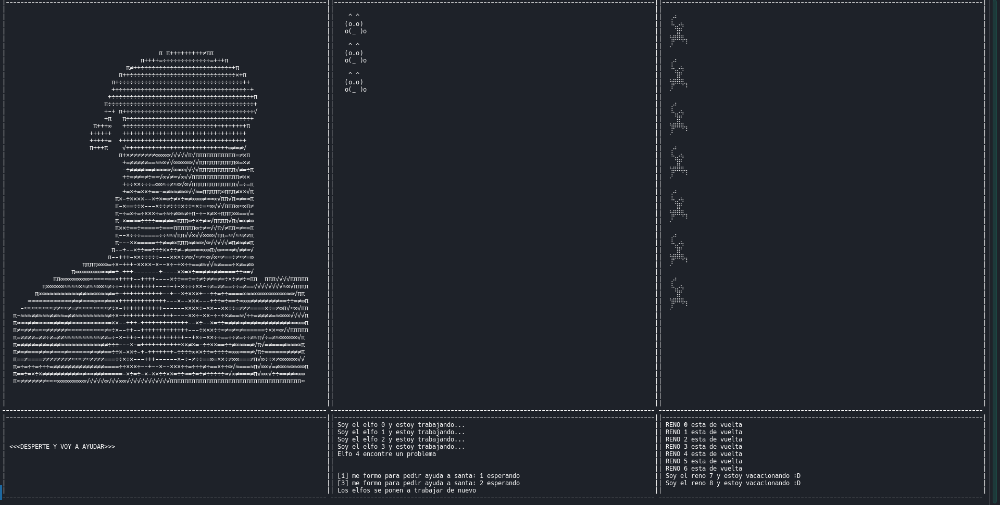
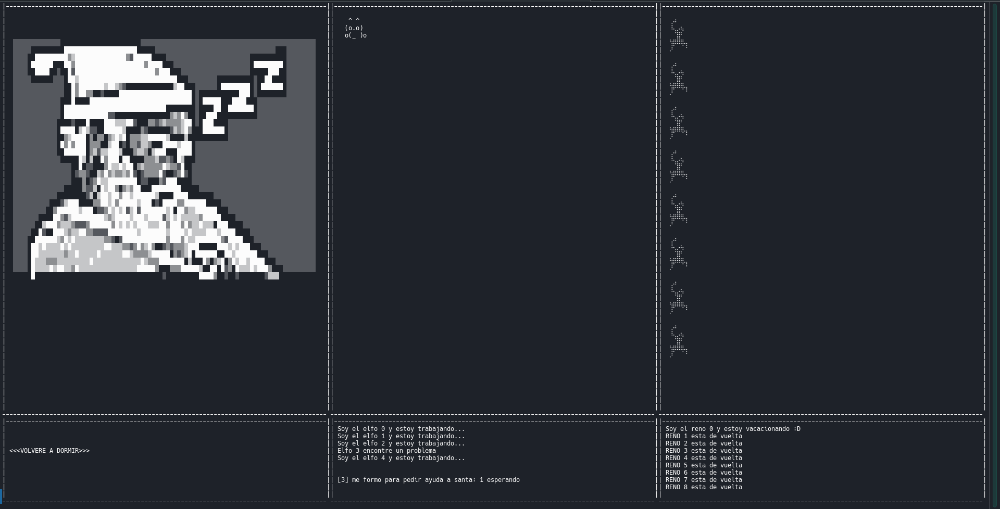
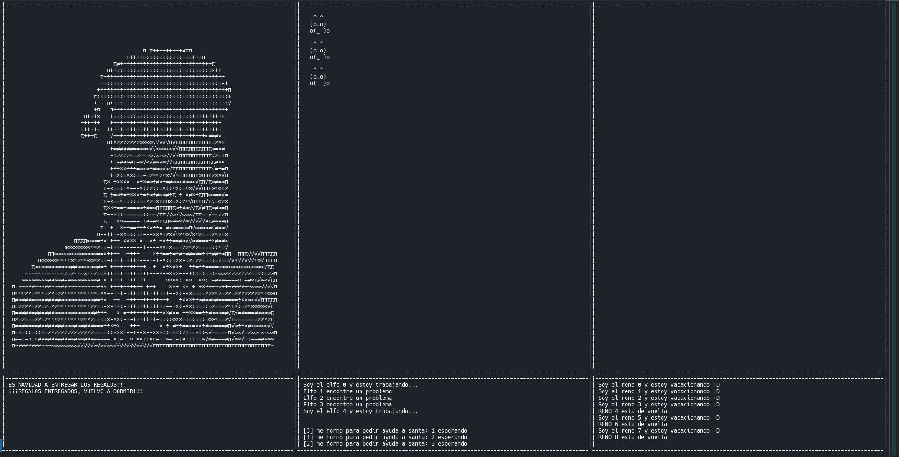
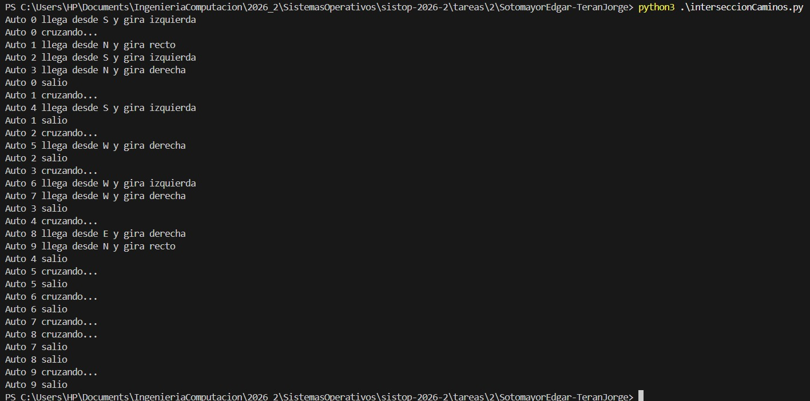

* El cruce del río
** Arias Alejandro
- Documentación :: [[./AriasAlejandro/README.md][README.md]]
- Archivos :: [[./AriasAlejandro/Cruce.py][Cruce.py]]
- Comentarios ::
  - Me gusta cómo estableces la validación al recibir los datos de entrada,
    evitando /quedar colgado/ si hay un número impar de algún tipo o algún
    número no divisible entre cuatro global. ¡Bien!
  - Implementación tradicional limpia, utilizando ~Barrier~, un semáforo
    por cola.
  - Solo volcado a consola como bitácora mediante mensajes de texto
    ("Hacker está esperando", "balsa zarpando").
- Calificación :: 10

** Cruz Samuel
- Documentación :: [[./CruzSamuel/README.md][README.md]]
- Archivos :: [[./CruzSamuel/ProblemaBalsa.py][ProblemaBalsa.py]]
- Comentarios ::
  - implementación basada en VCs. ¡Muy bien! 😃
  - Llama a mi atención que en el desarrollo del programa se presentan
    esperas... a veces demasiado largas? Llego a ver que tenemos ~Hacker 1
    llega. Esperando: 3H, 3S~. ¿Por qué puede ocurrir así?
  - Tu implementación ilustra una ventaja de las VCs: Si bien entender las
    interacciones que se pueden presentar /parece más complicado/, la
    lógica resultante (con sólo una VC y su mutex relacionada) resulta más
    simple 😃
    - Aunque, efectivamente, reconozco lo que comentas en tu README como
      problemático al emplear ~notify_all~
    - Empíricamente, el programa funciona correctamente, pero no estoy del
      todo convencido del manejo de ~allowed_hackers~ y ~allowed_serfs~:
      ¿Será que se confiaron de que pasa únicamente una cosa a la vez por
      estar usando un ~mutex~?
    - Lo correcto (/¡creo!/) sería utilizar ese ~mutex~ _exclusivamente_
      para la VC, y sincronizar otras estructuras compartias (como
      ~allowed_hackers~ y ~allowed_serfs~ mediante /otros/ mecanismos de
      sincronización.
  - Tienes código no utilizado (nunca llamas a
    ~_no_es_posible_formar_grupo()~)
  - Solo bitácora en consola con prints de estado, sin desarrollo de
    interfaz.
- Calificación :: 10

* Los alumnos y el asesor
** Arzate Adrian, Diaz David
- Documentación :: [[./ArzateAdrian-DiazDavid/README.md][README.md]]
- Archivos :: [[./ArzateAdrian-DiazDavid/alumnos_y_asesor.py][alumnos_y_asesor.py]]
- Comentarios ::
  - Solución funcional con semáforo para sillas (~multiplex~); mutex
    (~Lock~) y VC (~Condition~) para sincronización alumno-profesor.
    - ¡Muy bien por usar VCs!
    - *Falta implementar*: El código no contempla que, si no hay alumnos, el
      profesor se recuesta a dormir.
  - ¡Me parece muy bien que busquen terminar limpiamente, atrapando la
    excepción ~KeyboardInterrupt~!
    - Pero... ¿No resularía más limpio atrapar =SIGINT= en un manejador de
      señales? (para evitar que un segundo ~Ctrl-C~ de nosotros los
      desesperados termine con una mala terminación en uno de los hilos:
      #+begin_src text
	El alumno 1 entró al cubiculo
	El alumno 1 está resolviendo una duda
	El Profesor está resolviendo una duda
	^Cfinalizacion
	^CTraceback (most recent call last):
	  File "/usr/lib/python3.13/threading.py", line 1543, in _shutdown
	    _thread_shutdown()
	KeyboardInterrupt: 
      #+end_src
    - Dado que usan ~profesor.daemon = True~ en profesor pero no en alumnos, lo que
      puede causar una terminación abrupta, particularmente dado que el
      bucle de generación de alumnos es infinito.
  - Solo bitácora en consola
- Calificación :: 7

** Campos Isaac, Martinez Alejandro
- Documentación :: [[./CamposIsaac-MartinezAlejandro/README.md][README.md]]
- Archivos :: [[./CamposIsaac-MartinezAlejandro/asesor.c][asesor.c]]
- Comentarios ::
  - ¡Muy bien no quedarse en mi “zona de confort” y presentar una
    implementación en C!
    - *Ojo*: Un programa en C debe compilarse. Siguiendo sus indicaciones,
      se compila al archivo ~asesor~. Eché de menos un ~.gitignore~ que
      evitara que crear este archivo me /ensuciara/ el árbol Git 🙁
  - Implementación en C con semáforos (multiplex para ~sillas~,
    señalización para ~hayAlumnos~, mutex para proteger
    ~encolar()/desencolar()~), hilo de reporte periódico.
    - *Falta implementar*: El código no contempla que, si no hay alumnos,
      el profesor se recuesta a dormir.
  - Me parece muy bien que usen construcciones distintas de las vistas en
    clase. Pero en su manejo de las sillas utilizando un ~sem_trywait()~,
    caen en un antipatrón que mencioné explícitamente en clase:
    #+begin_src C
        // intenta agarrar una silla
        if (sem_trywait(&sillas) == 0) {
            printf("Alumno %d se sienta\n", id);
      /* (...) */
        } else {
            // no hay silla
            printf("Alumno %d no encontro silla, regresa\n", id);
            usleep((rand_r(&semilla) % 1000 + 500) * 1000);
        }
    #+end_src
    - Esto es para fines prácticos (a pesar del ~usleep~) una espera
      activa. Si subimos el número de alumnos a... 100, naufragamos entre
      idas y venidas innecesarias:
      #+begin_src text
	Alumno 17 llega (3 dudas)
	Alumno 17 no encontro silla, regresa
	Alumno 16 llega (3 dudas)
	Alumno 16 no encontro silla, regresa
	Alumno 2 llega (3 dudas)
	Alumno 2 no encontro silla, regresa
	Alumno 49 llega (2 dudas)
	Alumno 49 no encontro silla, regresa
	Alumno 34 llega (1 dudas)
	Alumno 34 no encontro silla, regresa
	Alumno 19 llega (3 dudas)
	Alumno 19 no encontro silla, regresa
	Alumno 52 llega (2 dudas)
	Alumno 52 no encontro silla, regresa
	Alumno 95 llega (1 dudas)
	Alumno 95 no encontro silla, regresa
	Alumno 94 llega (2 dudas)
	(...)
      #+end_src
    - Todo este ir y venir se resolvería automáticamente con un
      ~sem_wait(&sillas)~ no-condicional: Cada uno sencillamente esperará
      su turno pacientemente.
  - Bitácora de eventos a consola; reportes periódicos del estado global
- Calificación :: 8

** Chacon Hugo, Valdez Sebastian
- Documentación :: [[./ChaconHugo-ValdezSebastian/README.md][README.md]]
- Archivos :: [[./ChaconHugo-ValdezSebastian/asesor.py][asesor.py]]
- Comentarios ::
  - Basado en semáforos: Señalización mediante ~alumnos_esperando~ y
    ~asesor_disponible~, mutex en ~mutex~ para proteger de accesos
    concurrentes a ~sillas_disponibles~
  - ¡Uy! Con una implementación como esta, hasta me daría miedo dar
    clase... ¡Cada alumno va y vuelve infinitas veces! Sí, cada vez tiene
    unas pocas preguntas... pero los cinco alumnos vuelven y vuelven y
    vuelven con el profe para siempre 😱
    - ¡No es de sorprender que el profesor se quede dormido al terminar de
      responder cada pregunta, incluso cuando hay alumnos en algunas de las
      sillas...
      #+begin_src text
	=================================================================
	ALUMNO / EVENTO           | ESTADO ASESOR        |  SILLAS LIBRES 
	=================================================================
	(...)
	Alumno 4 se va (lleno)    | ---                  |        0       
	Terminó asesoría          | DURMIENDO...         |        0       
	Atendiendo alumno         | OCUPADO              |        1       
	Alumno 3 se sienta        | ---                  |        0       
	Terminó asesoría          | DURMIENDO...         |        0       
	Atendiendo alumno         | OCUPADO              |        1       
	Alumno 4 se sienta        | ---                  |        0       
	Alumno 2 se va (lleno)    | ---                  |        0       
	Terminó asesoría          | DURMIENDO...         |        0       
	Atendiendo alumno         | OCUPADO              |        1       
      #+end_src
  - Bitácora a consola en formato tabular; los eventos reportados (llegada,
    pregunta y salida de alumnos) presentan el estado del asesor y el
    número de sillas libres
    - Ya que lo mencionan como una mejora posible a su código: Para poder
      actualizar /en su lugar/ una tabla de resultados, probablemente lo
      más sencillo sería utilizar la biblioteca /Curses/.
    - Por otro lado, podrían hacer que cada hilo registrara su estado
      actual en una estructura de datos (sin imprimir resultados), y tener
      un hilo de actualización periódica presentando la tabla /completa/
      del estado.
- Calificación :: 8

** Espinosa Sara, Rosete Karina
- Documentación :: [[./EspinosaSara-RoseteKarina/readme.md][readme.md]], [[./EspinosaSara-RoseteKarina/salida_ejemplo.txt][salida_ejemplo.txt]]
- Archivos :: [[./EspinosaSara-RoseteKarina/alumnos_asesor.py][alumnos_asesor.py]]
- Comentarios ::
  - ¡Muy bueno que hicieran su implementación con valores /default/
    sensibles, pero con capacidad de especificarlo mediante ~argparse~!
    ¡Muy cómodo!
    - Excelente además que tengan la conciencia de la utilidad de emplear
      una semilla para el generador pseudoaleatorio. ¡Excelente! 😃
  - Excelente que identifiquen que mi problema es una adaptación del
    problema del barbero dormilón 😃
  - Interesante implementación, orientada a objetos, bastante más limpia de
    lo que mi conocimiento de Python logra 😉
    - Tipos de dato explícitos, decoradores, ~lambdas~... 👍
  - Semáforo ~Multiplex~ para el acceso a sillas. Semáforo ~Señalización~
    para indicar que hay preguntas listas, alumnos esperando.
    - ¡Ojo! Al igual que en la implementación de Hugo y Sebastián, el
      profesor se queda dormido al término de cada pregunta, y cada nueva
      pregunta lo despierta (no espera a quedarse sin alumnos en el
      cubículo). Está bien que en la Universidad nos exploten, ¡pero no es
      para tanto! 😉
  - Bitácora a consola. Cada línea a bitácora presenta un /timestamp/ a
    milésimas de segundo y un /emoji largo/ siguiendo la naturaleza del
    mensaje
- Calificación :: 9

** Ferrer Jose
- Documentación :: [[./FerrerJose/README.txt][README.txt]]
- Archivos :: [[./FerrerJose/alumnos_asesor.py][alumnos_asesor.py]]
- Comentarios ::
  - Solución sencilla, con dos semáforos para señalización y un mutex para
    proteger a la cola de alumnos esperando (lista)
    - Si un alumno no encuentra silla disponible, se va “y regreso después”
  - El asesor evalúa, tras ser despertado por ~alumnos_esperando~, que
    ~cola_alumnos~ no esté vacío. ¿Podría estarlo? ¿Cómo?
  - El asesor “va a dormir” cada vez que termina de atender una pregunta,
    sin importar que haya otros alumnos sentados frente a él (y lo
    despierten casi-de-inmediato).
  - Únicamente bitácora en consola.
- Calificación :: 8

** Quiroz Sergio
- Documentación :: [[./QuirozSergio/README.md][README.md]]
- Archivos :: [[./QuirozSergio/asesor.py][asesor.py]]
- Comentarios ::
  - Manejo de cola FIFO con ~queue.Queue~, semáforos ~mutex~ protegiendo a
    los contadores de alumnos en el sistema y a las variales para métricas,
    y señalización mediante =turnos=
    - El manejo de =turnos= como un diccionario (/hash/) para que el
      profesor atienda a todas las solicitudes del alumno en cuestión me
      pareció ingeniosa 😃
  - Ojo: Si bien se ajusta decentemente a la narrativa, deberías evitar
    /cruzar responsabilidades/: en tu línea 48, es el _profesor_ el que
    emite el texto ~Alumno {alumno_id} realiza pregunta {i+1}~. ¡Eso
    únicamente debería decirlo el _alumno_!
  - Bitácora en consola, con totalización de estadísticas periódicas
- Calificación :: 8

* Santa Claus
** Atilano Leonardo
- Documentación :: [[./AtilanoLeonardo/README.md][README.md]]
- Archivos :: [[./AtilanoLeonardo/santa_claus.py][santa_claus.py]]
- Comentarios ::
  - ¡Pobre Santa! Tu implementación muestra claramente que apenas le da
    tiempo de descansar al pobre... 😉
  - Implementación correcta con semáforos y mutex, y prioridad a renos
  - Interfaz visual completa con curses, posición fija de elementos,
    /emojis/.
    - Buena solución que comentas en la documentación respecto a la
      actualización de textos en /Curses/. Me parece que es el mecanismo
      más habitual.
- Calificación :: 10

** Blancas Isaias, Martinez Hans
- Documentación :: [[./BlancasIsaias-MartinezHans/Doc.md][Doc.md]]
- Archivos :: [[./BlancasIsaias-MartinezHans/programa_santa.py][programa_santa.py]]
- Comentarios ::
  - Solución robusta con semáforos (santa_sem, reno_sem, elfo_sem) y mutex,
    prioridad a renos, e interfaz curses con actualización dinámica de
    estado por coordenadas.
  - Problemas: la función actualizar_estado captura excepciones genéricas;
    los contadores de renos y elfos se actualizan sin semáforo de grupo (un
    cuarto elfo podría entrar si el grupo actual no ha sido atendido).
  - Interfaz curses, etiquetas fijas y actualización por coordenadas; buena
    separación visual entre renos y elfos.
    - Pero los eventos /ya ocurridos/ no son limpiados limpiamente de
      pantalla, llevando a una interfaz que muestra el estado engañosamente 🙁
    - Se corrige agregando una línea al final de ~reno()~ y otra al final
      de ~elfo()~ sobreescribiendo con espacios la información de cada
      instancia
    - ...o separando la lógica de acción de la de visualización, pero eso
      requiere cirugía mayor 😉
- Calificación :: 8

** Brena Victor, Cruz Lizbeth
- Documentación :: [[./BrenaVictor-CruzLizbeth/README.md][README.md]], [[./BrenaVictor-CruzLizbeth/cap_1.png][cap_1.png]], [[./BrenaVictor-CruzLizbeth/cap_2.png][cap_2.png]], [[./BrenaVictor-CruzLizbeth/cap_3.png][cap_3.png]]
- Archivos :: [[./BrenaVictor-CruzLizbeth/santa.py][santa.py]]
- Comentarios ::
  - Uso de mutex, semáforos individuales por elfo/reno (~elfos_sems~,
    ~renos_sems~)
    - Manejo de terminación sobre distintos hilos con evento
      ~stop_event~. ¡Bien! 😃
    - Algunas /secciones críticas/ son demasiado pesadas. Por ejemplo,
      tanto en =reno()= como en =elfo()=, mantienen el =mutex= (único)
      durante la mayor parte de la vida. ¡Elfos y renos deberían usar
      distintos =mutexes=! Además, la mayor parte de la sección crítica
      identificada podría sacarse de ese tratamiento especial.
  - Problemas: el contador elfos_cont puede superar 3 en la interfaz (los
    autores lo reconocen); los hilos de revisión de mensajes usan polling
    con after(300) que puede causar retrasos; time.sleep dentro de
    secciones críticas ralentiza la GUI.
  - Interfaz gráfica completa con Tkinter, empleando /frames/ separados por
    tipo de mensaje, notificaciones temporales y contadores
    - Buen esfuerzo hacia experiencia visual, aunque con limitaciones de
      rendimiento.
    - Falta un poco de diseño lógico a la interfaz: los /frames/ donde
      ocurre cada tipo de mensajes no necesariamente están en el lugar más
      lógico para que resulten claros
    - Posiblemente sería más claro si en vez de actualizar los frames,
      notificando desde la lógica, utilizaran un patrón /observador/, en
      vez de mezclar lógica y despliegue..?
- Calificación :: 8

** Gutiérrez Grimaldo Alejandro
- Documentación :: [[./GutiérrezGrimaldoAlejandro/README.md][README.md]], [[./GutiérrezGrimaldoAlejandro/img.png][img.png]]
- Archivos :: [[./GutiérrezGrimaldoAlejandro/santa_claus.py][santa_claus.py]]
- Comentarios ::
  - Implementación correcta con semáforos para señalización (sem_santa,
    sem_renos, sem_elfos), mutex para contadores, prioridad a renos
    - Reporte periódico de estadísticas.
  - Permite configurar número de elfos y duración al invocar de forma
    interactiva desde consola.
  - Bitácora de eventos a consola.
- Calificación :: 9

** Lopez Fernando, Gonzalez Luis
- Documentación :: , , , , , [[./LopezFernando-GonzalezLuis/Anexos/Redimensionar.png][Redimensionar.png]], [[./LopezFernando-GonzalezLuis/Anexos/Tamanio.png][Tamanio.png]], [[./LopezFernando-GonzalezLuis/README.md][README.md]], [[./LopezFernando-GonzalezLuis/up.txt][up.txt]], [[./LopezFernando-GonzalezLuis/zzz.txt][zzz.txt]]
- Archivos :: [[./LopezFernando-GonzalezLuis/tarea2.py][tarea2.py]]
- Comentarios ::
  - Sincronización mediante los patrones ~Barrera~ y ~Señalización~,
    empleados con semáforos tradicionales. Los contadores auxiliares,
    protegidos correctamente por mutexes.
  - Asumo y celebro el parecido que yo mismo hice notar 😉 Agradezco la
    confianza.
  - Está bien que indiquen que la simulación se interrumpe con ~Ctrl-C~,
    pero sería bueno que atraparan la señal y cerrara limpiamente...
  - Detalles de estilo: Codificar /en duro/ nueve veces a
    ~barreraRenos.release()~ y tres veces a ~barreraElfos.release()~ es
    /feo/ y dificulta el mantenimiento.
    - Ya su código apunta a mejorarlo (yo no diría /optimizarlo/, que es
      otra cosa) con un for, pero además eso les permitiría parametrizar a
      ~for i in range(NUM_RENOS)~ o ~NUM_BARRERA_ELFOS~...
  - Interfaz textual elaborada mediante Curses; actores del sistema
    presentados mediante imágenes ASCII-art
    - ¡Ojo! No mencionan que hace falta ejecutar desde el directorio de la
      entrega. No necesariamente es algo obvio 😉
    - ¡Guau! Jé, la gente siempre dice que yo uso tipo de letra muy
      pequeña, y mi monitor es 4K... Me gusta trabajar con letra muiy
      chiquita. Aún así, ¡270 columnas! Es _muy_ ancho 😉 (...y el mensaje
      en el código dice que “a 150 columnas”... Pero no, son 270)
    - ...La primera columna tiene que ser muy ancha por el “ASCII-art” que
      despliegan, pero... ¡las otras dos podrían ser mucho más estrechas!
    - Ojo: el validador verifica el ancho de la ventana al iniciar, pero
      una vez iniciado, no verifica que la condición se mantenga. Quedaría
      más limpio si hicieran la verificación al recibir una señal 28
      (~SIGWINCH~)
- Calificación :: 9

** Merida Francisco, Quezada Leonardo
- Documentación :: [[./MeridaFrancisco-QuezadaLeonardo/README.md][README.md]]
- Archivos :: [[./MeridaFrancisco-QuezadaLeonardo/T02.py][T02.py]]
- Comentarios ::
  - Implementación funcional con semáforos (santaSem, renoSem), mutex
    (mutex_num_elfos para limitar grupo de 3). Prioridad a renos mediante
    orden de verificación.
  - Interfaz curses con actualización de estado por filas, estilos de texto
    diferenciados, y contadores.
    - Mutex específico para proteger la interfaz (~screen_lock~). No estoy
      es necesario en este caso (lo emplea únicamente el único hilo de
      reporte), pero es un pensamiento en el sentido correcto.
- Calificación :: 10

** Torres Lozano Luis, Zavala Magaña Luis
- Documentación :: [[./TorresLozanoLuis-ZavalaMagañaLuis/documentacion_santa.txt][documentacion_santa.txt]]
- Archivos :: [[./TorresLozanoLuis-ZavalaMagañaLuis/santa_claus.c][santa_claus.c]]
- Comentarios ::
  - ¡Muy bien no quedarse en mi “zona de confort” y presentar una
    implementación en C!
    - *Ojo*: Un programa en C debe compilarse. Siguiendo sus indicaciones,
      se compila al archivo ~santa_claus~. Eché de menos un ~.gitignore~
      que evitara que crear este archivo me /ensuciara/ el árbol Git 🙁
  - Implementación en C clásica con mutex y cuatro semáforos (~sem_santa~,
    ~sem_reno~, ~sem_elfo~, ~puerta_elfos~). Uso correcto de ~puerta_elfos~
    como semáforo contador inicializado en 3 para limitar grupo de elfos
    concurrentes.
  - Bitácora de eventos a consola
- Calificación :: 9

* Gatos y ratones
** Basilio Andres
- Documentación :: [[./BasilioAndres/README.md][README.md]]
- Archivos :: [[./BasilioAndres/filosofos.c][filosofos.c]], [[./BasilioAndres/gatos_ratones.c][gatos_ratones.c]]
- Comentarios ::
  - ¡Muy bien no quedarse en mi “zona de confort” y presentar una
    implementación en C!
    - *Ojo*: Un programa en C debe compilarse. Siguiendo sus indicaciones,
      se compila al archivo ~gatos_ratones~. Eché de menos un ~.gitignore~
      que evitara que crear este archivo me /ensuciara/ el árbol Git 🙁
  - Implementa correctamente exclusión mutua entre especies con semáforos
    tipo Lectores-Escritores.
  - Solución sencilla y correcta mediante /intercambio expreso de turno/
    - Sin embargo... No contempla la lógica de verificación de que existan
      ratones al entrar un gato a comer
    - Aunque sea /código muerto/ (que nunca se llame), es uno de los
      requisitos de la implementación. Si no tuviéramos el /apagador/, los
      gatos y ratones entrarían libremente sin /cumplir su tarea/
    - Implementan correctamente el máximo de platos con ~platos_libres~,
      pero nada en la interfaz ilustra que lo consideren, hay que leerlo
      del fuente.
  - Únicamente salida a consola con mensajes de texto ("Gato X: Comiendo"),
    sin ningún componente visual o interfaz amigable.
- Calificación :: 8

** Gonzalez Fernando, Quezada Emir
- Documentación :: [[./GonzalezFernando-QuezadaEmir/README.md][README.md]]
- Archivos :: [[./GonzalezFernando-QuezadaEmir/gatosRatones.py][gatosRatones.py]]
- Comentarios ::
  - ¡Es la implementación del “acuerdo de caballeros” más interesante que
    he visto!
    - El primer gato en llegar /espera a que no haya ratones/ antes de
      pasar
    - Pero otros gatos /asumen/, si ya hay otros, que el cuarto es suyo...
    - ¡Y hay espacio para cachar ratones! → Reconozcamos que el
      /semi-apagador/ es... bastante débil 😉
  - Se presentan algunas interacciones que habría que analizar a detalle
    para entender qué pasó. Por ejemplo:
    #+begin_src text
      [gato 1:] Termina de comer y se va a jugar
      [raton 1]: Comiendo
      [raton 4]: Intentó comer pero es descubierto y sufre las consecuencias de su avaricia
      [raton 9]: Intentó comer pero es descubierto y sufre las consecuencias de su avaricia
      [raton 6]: Intentó comer pero es descubierto y sufre las consecuencias de su avaricia
      [raton 1]: Comió exitosamente y vivió para contarlo
      [gato 4]: Comiendo
    #+end_src
    - No indican cuándo llega o se va un gato
    - ¿Cómo puede el ratón 1 comer y sobrevivir, pero los 3 que llegaron
      mientras él estaba comiendo terminaron muertos?
  - Implementación completa con torniquete/mutex implementado para mitigar
    inanición de los gatos
  - Incluye conteo de ratones muertos como detalle narrativo.
  - Solo mensajes a bitácora con prints descriptivos, sin desarrollo de
    interfaz gráfica o representación.
- Calificación :: 9

* El elevador
** Bello Santiago, Lopez Baruc
- Documentación :: [[./BelloSantiago-LopezBaruc/Documentación_problema del elvador.txt][Documentación_problema del elvador.txt]]
- Archivos :: [[./BelloSantiago-LopezBaruc/elevador.py][elevador.py]]
- Comentarios ::
  - Implementación funcional con semáforo para capacidad
    (~semaforo_lugares~) y mutex para acceso a contadores; el elevador
    recorre pisos de forma lineal (sube y baja completamente).
  - Hilos independientes para el elevador, cada uno de los usuarios, y el
    reporte de estado
  - Parametrizado con los límites de diversos valores operativos al
    principio
    - Hay detalles que considerar, como la inicialización de
      ~USR_ESPERANDO~
    - Debe ser un número de ceros por lo menos igual al número de pisos que
      tenemos (incluyendo 0).
    - Podría simplificarse con ~[0 for i in range(PISOS+1)]~.
  - Ojo en la documentación: Sí, utilizaron un semáforo inicializado al
    número de lugares del elevador. Ese patrón de uso de semáforos tiene
    nombre: /Multiplex/.
  - Respecto al /área de mejora/ que mencionan: Si en vez de simplemente
    /imprimir/ a consola la situación del elevador lo hubieran hecho
    mediante una biblioteca como ~ncurses~ que permite el acomodo de datos
    en pantalla, no habrían tenido este problema de /limpieza/
    - Pero me pareció bastante buena interfaz, con buena claridad y
      extensibilidad.
  - Mensajes a bitácora mezclados con una clara representación tabular /
    semigráfica de la situación.
- Calificación :: 10

** Estrada Aldo, Sanchez Jazmin
- Documentación :: [[./EstradaAldo-SanchezJazmin/README.md][README.md]]
- Archivos :: [[./EstradaAldo-SanchezJazmin/elevador.py][elevador.py]]
- Comentarios ::
  - Me gusta que esté “personalizado¿ con los nombres de ustedes y sus
    compañeros 😃
  - Implementación robusta con clase Elevador que usa Lock,
    BoundedSemaphore para capacidad, y Condition para coordinación; incluye
    refinamiento anti-inanición con límite de movimientos en misma
    dirección (max_mov=5).
  - La estrategia para /evitar inanición/ me deja con dudas... Si tienen
    únicamente 5 pisos, limitar ~self.max_mov~ a 5, ¿tiene efecto práctico?
  - El código es un poco revuelto y difícil de seguir; por ejemplo:
    #+begin_src python
      def run(self):
          while self.funcionando:
              with self.lock_elevador:
                  if not self.funcionando:
                      break
    #+end_src
    En caso de que ~self.funcionando~ sea ~False~, no va a entrar a esta
    iteración.
    - Claro, puede cambiar entre que inició y que obtuvo a
      ~self.lock_elevador~, pero /me parece/ que no haría mucha
      diferencia(?)
  - Interesante que utilicen una solución con un ~BoundedSemaphore~ y dos
    ~Condition~. ¡Bien por aventarse sobre la complejidad! 😃
    (aunque... sin duda, resulta un poco más complicado de seguir 😵🥴)
  - Problemas: el refinamiento contabiliza movimientos incluso cuando no
    hay solicitudes, lo que puede cambiar dirección innecesariamente; la
    espera con timeout puede causar que personas se pierdan notificaciones.
  - Solo bitácora en consola con mensajes descriptivos ("Entrada -> Jaz
    subió en piso..."), sin interfaz visual más allá de texto.
- Calificación :: 9

** Garibay Josue, Lopez Carlos
- Documentación :: [[./GaribayJosue-LopezCarlos/README.md][README.md]]
- Archivos :: [[./GaribayJosue-LopezCarlos/elevador.py][elevador.py]]
- Comentarios ::
  - Implementación con curses para interfaz visual, uso de Condition por
    piso para sincronización, y elevador que recorre pisos completos para
    evitar inanición (sube hasta extremo antes de cambiar dirección).
  - Problemas: el refinamiento (recorrido completo) es ineficiente y puede
    causar tiempos de espera muy largos
    - (aunque esto ya lo saben, y lo documentan en su texto.
  - Desarrollo limpio y con buena orientación a objetos.
  - Interfaz curses con representación visual de pisos, elevador, pasajeros
    dentro, dirección y lista de espera; esfuerzo significativo hacia
    experiencia visual.
- Calificación :: 10

** Monroy Jesus, Poncede Leon Bruno
- Documentación :: [[./MonroyJesus-PoncedeLeonBruno/README.md][README.md]]
- Archivos :: [[./MonroyJesus-PoncedeLeonBruno/elevadorSincro.c][elevadorSincro.c]], [[./MonroyJesus-PoncedeLeonBruno/img/imgT2.jpeg][imgT2.jpeg]], [[./MonroyJesus-PoncedeLeonBruno/img/imgT21.jpeg][imgT21.jpeg]]
- Comentarios ::
  - ¡Muy bien no quedarse en mi “zona de confort” y presentar una
    implementación en C!
    - *Ojo*: Un programa en C debe compilarse. Siguiendo sus indicaciones,
      se compila al archivo ~elevadorSincro~. Eché de menos un ~.gitignore~
      que evitara que crear este archivo me /ensuciara/ el árbol Git 🙁
  - Implementación en C muy completa con patrón Monitor,
    Productor-Consumidor y Rendezvous; uso de mutex, variables de condición
    por piso, y algoritmo SCAN para evitar inanición.
  - Interfaz ncurses muy completa con representación gráfica de pisos,
    elevador, contadores de espera/destinos, y registro limpio de eventos
- Calificación :: 10

** Ortega Fernando
- Documentación :: [[./OrtegaFernando/README.md][README.md]]
- Archivos :: [[./OrtegaFernando/elevador_sync.py][elevador_sync.py]]
- Comentarios ::
  - Interesante manera de atender a la inanición: ¡con políticas y
    prioridades! ¡Muy bueno! (aunque complejo)
  - ¡Muy bonito manejo de Python, con ~@dataclass~, declaraciones de
    tipos... 😃
  - La lógica de implementación está cubierta con una pareja mutex (~Lock~)
    / VC (~Condition~).
  - Interfaz curses muy elaborada con tres columnas (esperando con destino,
    elevador con pasajeros, ya llegaron), log de eventos, y actualización
    en tiempo real; excelente experiencia visual y funcional.
- Calificación :: 10

* Intersección de caminos
** Fredy Navarro, Ramirez Emily
- Documentación :: [[./FredyNavarro-RamirezEmily/1.png][1.png]], [[./FredyNavarro-RamirezEmily/2.png][2.png]], [[./FredyNavarro-RamirezEmily/3.png][3.png]], [[./FredyNavarro-RamirezEmily/4.png][4.png]], [[./FredyNavarro-RamirezEmily/5.png][5.png]], [[./FredyNavarro-RamirezEmily/6.png][6.png]], [[./FredyNavarro-RamirezEmily/README.md][README.md]]
- Archivos :: [[./FredyNavarro-RamirezEmily/interseccion_de_caminos.cpp][interseccion_de_caminos.cpp]]
- Comentarios ::
  - ¡Muy bien no quedarse en mi “zona de confort” y presentar una
    implementación en C++!
    - *Ojo*: Un programa en C++ debe compilarse. Siguiendo sus
      indicaciones, se compila al archivo ~interseccion_de_caminos~. Eché
      de menos un ~.gitignore~ que evitara que crear este archivo me
      /ensuciara/ el árbol Git 🙁
  - Solución completa con división por cuadrantes, uso correcto de
    std::lock y RAII con lock_guard
  - El hilo visualizador es independiente, y es un actor en el “baile” de
    la sincronización.
  - El uso de ~lock_guard~ es conveniente y correcto (evita posibles
    bloqueos mutuos asegurando que un mutex adquirido no sea devuelto).
    - Sin embargo, me parece que la sincronización que realizan es /sobre
      el cruce completo/, no sector por sector.
  - El código es extenso y muestra trabajo de equipo
  - Presenta trabajo significativo hacia interfaz usuario amable: usa
    ncurses para mostrar autos en movimiento, cuadrantes etiquetados y
    panel de estados.
    - ¡Ojo! Al terminar la ejecución, debería reestablecer la terminal al
      manejo normal (~curs_set(1)~ y manejo de /eco/ a la terminal, por lo
      menos).
- Calificación :: 9

** Sotomayor Edgar, Teran Jorge
- Documentación :: [[./SotomayorEdgar-TeranJorge/README.md][README.md]]
- Archivos :: , [[./SotomayorEdgar-TeranJorge/interseccionCaminos.py][interseccionCaminos.py]]
- Comentarios ::
  - Implementación minimalista y limpia
  - Semáforos por cuadrante
    - La lógica y la implementación tienen lógica tal vez un poco demasiado
      “fuertemente acoplada”: Resuelven la situación planteada,
      pero... ¿Qué tan difícil sería de adaptar para adecuar el
      planteamiento?
    - Declaran un ~semaforo_torniquete~, pero se utiliza únicamente como un
      /mutex/ para la adquisición de los semáforos que cada hilo va a usar
    - Más que evitar la inanición, evitan los /bloqueos mutuos/. ¡Pero es
      una buena e ingeniosa implementación! (recuerda un poco a la /cena de
      los filósofos/, ¿no?)
  - Código conciso (~70 líneas) con lógica clara.
  - Se limita a volcado de bitácora a consola con prints, sin desarrollo de
    interfaz visual o representación gráfica de la intersección.
- Calificación :: 8

# ############################################################
